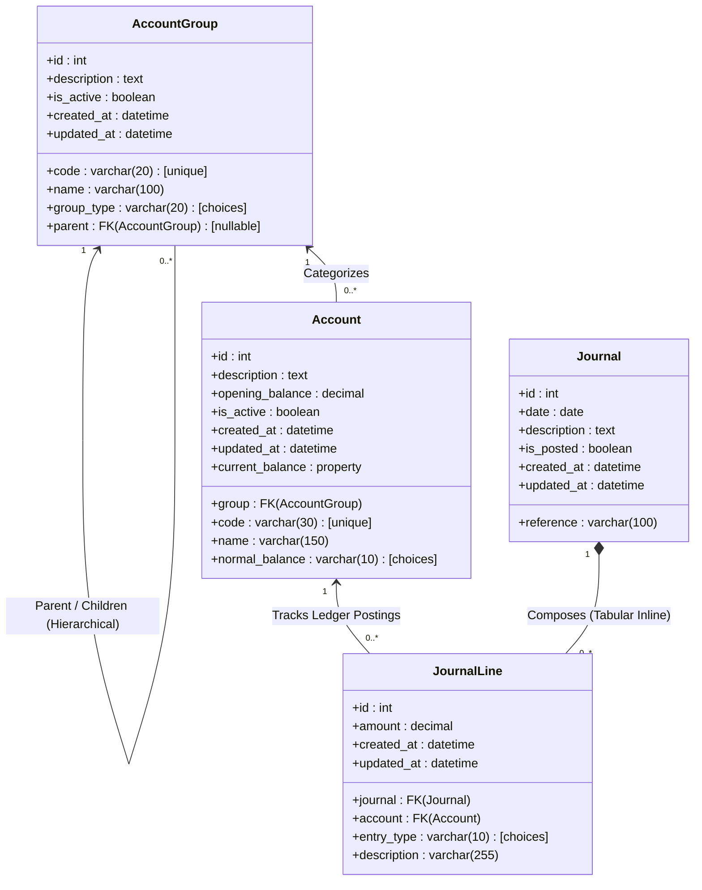
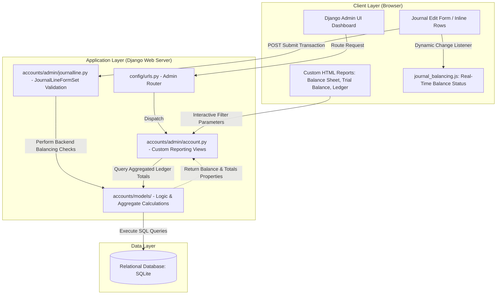

# Double-Entry Accounting Ledger System

A professional, robust, and clean Double-Entry Bookkeeping & Accounting Ledger system built with **Django**. This application manages accounts hierarchically, enforces rigorous balancing constraints on journal postings, and dynamically generates key accounting reports (Trial Balance, Balance Sheet, and Ledger Reports) through a highly customized and streamlined Django Admin interface.

---

## 🏛️ Project Architecture & Data Flow

The project consists of a rich, database-backed Django app that leverages Django's robust Admin framework as its primary user interface. Front-end scripting ensures real-time user validation, while Django-side FormSets guarantee data integrity before transactions are committed to the ledger.

### 1. Domain Model (Entity-Relationship Diagram)

The relational structure of the ledger enforces standard accounting principles. Accounts are categorized under a parent-child hierarchy of `AccountGroup`s (e.g., Assets, Liabilities, Equity, Revenues, Expenses), and transactions are recorded via a strictly-balanced composition of `Journal` and `JournalLine` records.



### 2. System Architecture & Information Flow

The architecture is designed to deliver immediate, server-validated report computation and real-time client-side feedback during transaction editing.



---

## ✨ Core Features

*   **Chart of Accounts Hierarchy**: Group accounts dynamically using recursive `AccountGroup` instances with specific categories: **Asset**, **Liability**, **Equity**, **Revenue**, or **Expense**.
*   **Double-Entry Validation**: 
    *   **Frontend**: Built-in interactive JavaScript (`journal_balancing.js`) displays running debit/credit totals and differences live as you edit.
    *   **Backend**: Strict database-level transaction control in `JournalLineFormSet`. A transaction can *only* be marked as **is_posted = True** if total debits equal total credits and at least two line items exist.
*   **Dynamic Financial Reports**:
    *   **Trial Balance**: Beautifully formatted summary of debit and credit balances grouped by account category to prove ledger parity.
    *   **Balance Sheet**: Standard financial report evaluating `Assets = Liabilities + Equity` with automatic current year **Net Income** computation (`Revenue - Expense`).
    *   **Ledger Report**: Detailed transaction statement for any individual account, filterable by date range, displaying period opening balances, transaction-specific opposing counterpart entries, and running ledger balances.
*   **Custom Administration Interface**: Standard Django administrative capabilities (user, group, log tracking) are elegantly decluttered and customized to provide a branded, professional application experience.

---

## 📂 Project Directory Structure

The repository is organized following clean Django modular architecture principles:

```text
/home/mohammadsajal/sajal/test/account/
├── config/                             # Core Django settings & configuration
│   ├── settings.py                     # Main project settings & database configuration
│   ├── urls.py                         # Root URL routing, maps all URLs to customized admin site
│   └── wsgi.py / asgi.py               # WSGI and ASGI server gateways
├── accounts/                           # Core double-entry accounting application
│   ├── models/                         # Database Domain models
│   │   ├── account.py                  # Account details, balance calculation properties
│   │   ├── group.py                    # Account group classifications (Asset, Liability, etc.)
│   │   ├── journal.py                  # Journal header information
│   │   └── journalline.py              # Individual Debit/Credit line items
│   ├── admin/                          # Customized Django Admin panel interfaces
│   │   ├── account.py                  # Custom admin views for Balance Sheet, Ledger & Trial Balance
│   │   ├── group.py                    # Admin management for Account Groups
│   │   ├── journal.py                  # Main Journal transaction interface with Line inlines
│   │   └── journalline.py              # Inline Formset custom validation rules
│   ├── static/accounts/js/             # Front-end interactive assets
│   │   └── journal_balancing.js        # Real-time transaction balancing check
│   ├── templates/admin/accounts/       # Custom-built dashboard and report pages
│   │   ├── balance_sheet.html          # Balance Sheet report UI
│   │   ├── ledger_report.html          # Ledger statement UI
│   │   └── trial_balance.html          # Trial Balance report UI
│   ├── tests.py                        # Comprehensive Django unit and integration test suite
│   └── apps.py                         # App metadata configuration
├── requirements.txt                    # Project dependency manifest
├── deploy.sh                           # Shell script for automated initialization & superuser creation
└── manage.py                           # Django CLI administration wrapper
```

---

## 🚀 Installation & Setup Instructions

Follow these step-by-step instructions to install dependencies, run database migrations, initialize the ledger, and start the development server.

### 1. Prerequisites
Ensure you have the following software installed on your operating system:
*   **Python 3.10+** (Verify via `python3 --version` or `python --version`)
*   **pip** (Python Package Installer)
*   **Bash Shell** (For executing the automated deployment script on Linux/macOS)

---

### 2. Clone the Repository & Navigate to Workspace
Open your command terminal and navigate to your project root workspace directory:
```bash
cd /home/mohammadsajal/sajal/test/account
```

---

### 3. Set Up Python Virtual Environment
Initialize a clean Python virtual environment to isolate project-specific dependencies:

*   **On Linux/macOS:**
    ```bash
    python3 -m venv venv
    source venv/bin/activate
    ```
*   **On Windows (Command Prompt):**
    ```cmd
    python -m venv venv
    venv\Scripts\activate
    ```
*   **On Windows (PowerShell):**
    ```powershell
    python -m venv venv
    .\venv\Scripts\Activate.ps1
    ```

Once activated, your terminal prompt will display a `(venv)` prefix.

---

### 4. Install Dependencies
Install all required package versions listed in `requirements.txt`:
```bash
pip install -r requirements.txt
```
*Dependencies installed include: Django, gunicorn, sqlparse, and whitenoise.*

---

### 5. Run Database Migrations
Initialize the database schemas by compiling and running the migrations:
```bash
python manage.py makemigrations
python manage.py migrate
```

---

### 6. Create Admin Superuser (Ledger Access)
To log in and access the administrative portal, create an administrator user:
```bash
python manage.py createsuperuser
```
Follow the interactive prompts to define your administrative username, email, and password.

#### Alternative: Quick Setup (Automated Initialization)
For an automated setup that installs dependencies, executes migrations, and configures a default superuser:
```bash
chmod +x deploy.sh
./deploy.sh
```
*Note: The automated script initializes a default superuser with the credentials: **Username: `admin`** and **Password: `admin`**.*

---

### 7. Run the Local Development Server
Start the Django development server locally on your machine:
```bash
python manage.py runserver
```
The application will launch on your local host port: `http://127.0.0.1:8000/`.

Open your web browser and navigate to **`http://127.0.0.1:8000/admin/`** to log in using either your manually created superuser or the default credentials (`admin`/`admin`).

---

## 🧪 Running the Test Suite

The project includes a comprehensive suite of unit and integration tests located in `accounts/tests.py`. These tests validate double-entry balancing logic, financial calculation properties, date range filtering, and dashboard routing.

To run the entire test suite, execute the following command:
```bash
python manage.py test
```

Expected successful test output:
```text
Found 9 test(s).
System check identified no issues (0 silenced).
.........
----------------------------------------------------------------------
Ran 9 tests in 0.285s

OK
```

---

## 📊 Quick-Start Guide: Using the Ledger

1.  **Configure Account Groups**: Navigate to **Account Groups** and register your categories (e.g., *Current Assets*, *Owners Equity*, *Cost of Goods Sold*), building out a hierarchy with parent groups.
2.  **Define Chart of Accounts**: Navigate to **Accounts** and map out individual ledger accounts (e.g., *Cash*, *Accounts Receivable*, *Retained Earnings*, *Sales Revenue*), assigning their category normal balance (Debit or Credit) and an optional opening balance.
3.  **Post Journal Entries**:
    *   Navigate to **Journals** and select **Add Journal**.
    *   Input a date and standard description.
    *   Add ledger entry rows (minimum 2).
    *   When ready to permanently post, toggle **is_posted** to active and click **Save**. The system will intercept and block the save if total debits do not balance with total credits.
4.  **View Financial Reports**: Use the custom sidebar links on the left side of the admin dashboard to view the **Trial Balance**, **Balance Sheet**, or **Ledger Report** (filtered dynamically by date and account name).
